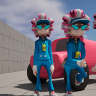

# Project Name  Weeks 08, 09, 10

## Description

A github repository for the in class demonstration code discussing blendspaces, animations, and animation blueprints along with a simple NPC.    
 
## Usage
Clone, or download the zip, to a local directory. Open in Unreal Engine 5.4 or newer

## Attributions
1) "Sporty Granny" character from Mixamo, ( https://www.mixamo.com/#/?page=1&query=sporty&type=Character )
2) 

